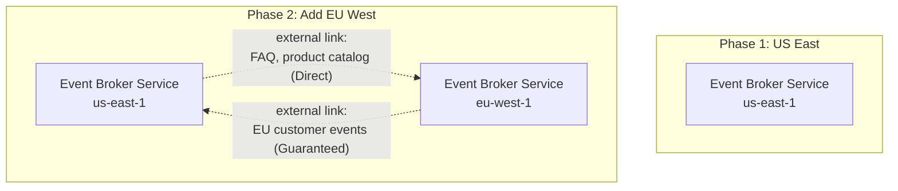

# Getting Started with Solace Architect

This guide walks you through a complete architecture engagement using Solace Architect. You will start with a business problem, run every skill in the toolkit, and end with a finished engineering blueprint and a browsable HTML report. The scenario is a retail banking AI assistant, the kind of project where event-driven architecture, Solace Agent Mesh (SAM), and strict compliance requirements all intersect.

By the end, you will understand what each skill does, when to use it, what it asks, and what it produces. You can follow along step by step or skip ahead to the skills that interest you.

---

## Prerequisites

- [Claude Code](https://docs.anthropic.com/en/docs/claude-code) installed and authenticated
- [Bun](https://bun.sh) >= 1.0.0
- Git

## Install

```bash
git clone https://github.com/solacecommunity/solace-architect.git
cd solace-architect
./install-solace-architect.sh
```

`install-solace-architect.sh` installs dependencies, generates SKILL.md files, and symlinks skills into `~/.claude/skills/solace-architect/`. Verify it worked:

```bash
bun test
```

You should see all tests passing. Now open Claude Code in any directory:

```bash
claude
```

### Using with other AI coding agents

Solace Architect supports 10 AI coding agent hosts. External host skill files (`.agents/`, `.cursor/`, `.kiro/`, etc.) are **not checked into the repo** — they are build artifacts generated from the same `.tmpl` templates. To generate them:

```bash
bun run build                          # generate for all 10 hosts
bun run gen:skill-docs --host codex    # generate for a single host (e.g., Codex)
```

Then launch the agent from the project root. It will discover its skills in the host-specific directory (e.g., `.agents/skills/` for Codex).

---

## Key commands

Most users only need these commands:

| Command | Purpose |
|---------|---------|
| `/solace-intake` | Skip the interview — fill out a template offline, then import. |
| `/solace-discovery` | Start a new project. Describe systems and goals. |
| `/solace-plan` | Run the full engagement. Picks skills, runs them in order, threads context between them. |
| `/solace-intake-review` | Optional but recommended after an intake import: architect-grade critique of the intake (contradictions, gaps, starved fields) reconciled with you before design consumes it. `--report` for findings-only. |
| `/solace-projects` | Dashboard. Status, timing, summary, switch projects, launch the web UI. |

Alternatively, use `/solace-intake` to generate a DOCX template for offline requirements gathering. Import the completed template to skip interactive discovery.

Everything else is available as individual slash commands if you want to re-run a specific step or skip the orchestrator entirely. There are 23 slash commands in total: 4 start-here + 10 design + 4 review + 3 finalize + 2 utility = 23.

---

## The scenario

You are a solutions architect at a mid-size retail bank. The bank wants to build an AI-powered customer assistant that works across three channels: a web chat widget on the banking portal, the bank's mobile app, and the internal Slack workspace. Customers should be able to check balances, view transaction history, initiate fund transfers, submit support tickets, and ask common questions about products and policies.

The backend systems are:

| System | Role | Current protocol |
|--------|------|-----------------|
| Core Banking Platform | Account data, balances, transactions | REST API (Java) |
| Transaction Database | Transaction history | PostgreSQL |
| CRM | Customer profiles, support tickets | Salesforce |
| Knowledge Base | FAQ, product info, policies | Internal wiki |

The bank currently runs IBM MQ for batch processing between the core banking platform and downstream systems. The new assistant project is greenfield, but the batch flows on IBM MQ need to coexist with the new event-driven architecture, and eventually migrate.

Compliance constraints: PCI-DSS, SOC 2, data residency (US only). All financial transactions must be auditable with 7-year retention.

The team: 6 people (2 platform engineers, 4 application developers). New to Solace. Experienced with event-driven patterns conceptually, but haven't built on Solace before. Currently use Datadog for observability and GitHub Actions for CI/CD. Timeline: MVP in production in 4 months. Preference for cloud-managed services to minimize ops burden.

Phase 2 (6 months out): expand to a European region for UK/EU customers, which will require multi-region deployment and data residency compliance for GDPR.

---

## Step 1: Orient yourself — `/solace-help`

Start every engagement by seeing what's available.

### What you type

```
/solace-help
```

### What happens

Solace Architect prints:

1. **Getting Started** — the three primary commands: `/solace-discovery`, `/solace-plan`, `/solace-projects`
2. **Active project status** — since this is your first run, it will say "No active project"
3. **Individual skills catalog** — Design, Review, and Finalize skills (these run automatically via `/solace-plan`)
4. **Grounding documents** — the reference material that backs all recommendations

### What you learn

You only need three commands. `/solace-discovery` starts a project. `/solace-plan` orchestrates the full engagement, picking the right skills, running them in order, and threading context between them. `/solace-projects` is your dashboard for status, timing, project switching, and launching the web UI.

### Key concept: Skills are modular

Each skill reads the project's accumulated state (previous decisions, artifacts, progress) and writes its own outputs. You can run skills in any order, but the recommended sequence exists because later skills build on earlier ones. If you skip one, the next skill will tell you what's missing.

---

## Step 2: Discover the problem — `/solace-discovery`

Discovery is the foundation. It captures the system landscape, requirements, constraints, and goals before any design work begins.

### What you type

```
/solace-discovery
```

### What happens first: Project creation

Since no project exists yet, discovery asks for a project name:

> What should we call this project? Give it a short name (e.g., "acme-bank-chat", "global-market-data", "factory-telemetry"). I'll use this as the project identifier.

**You type:** `Retail Banking Chat Agent`

Solace Architect slugifies this to `retail-banking-chat-agent` and creates the project directory:

```
projects/retail-banking-chat-agent/
  context.yaml          # project metadata
  decisions.yaml        # accumulated design decisions (empty for now)
  progress.yaml         # skill execution log
  feedback.yaml         # feedback on skill output quality
  artifacts/
    00-intake-review/   # only when /solace-intake-review ran
    01-discovery/       # where this skill's output goes
    02-topic-design/    # future skills populate these
    03-broker-select/
    04-sam-design/
    05-protocol-select/
    06-mesh-design/
    07-ha-dr/
    08-integration/
    09-migration/
    10-reviews/
    11-validation/
    12-blueprint/
    13-event-portal/
    14-executive/
```

### What happens next: Project type selection

Discovery uses **AskUserQuestion** to ask what kind of project this is. AskUserQuestion presents a structured decision brief with a recommendation callout, per-option pros/cons, and clickable options. It looks something like this:

```
D1 — What type of project is this?

Context: Determines which skills the engagement needs —
wrong type means missed steps or unnecessary work.

> **Recommended: D) SAM integration**
> Why: The project centers on an AI assistant with multiple
> backends and channels — this is a SAM pattern.

A) New build
  Pros: Clean slate, no legacy constraints
  Cons: No migration planning; wrong if MQ coexistence is needed
  Completeness: 60% — misses agent mesh design

B) Migration
  Pros: Covers MQ transition path
  Cons: Focuses on migration, not the AI assistant
  Completeness: 40% — wrong primary pattern

C) Extension
  Pros: Right if Solace is already in place
  Cons: This is greenfield, not extending existing Solace
  Completeness: 30% — wrong premise

D) SAM integration (recommended)
  Pros: Covers agent mesh, channels, backends, MQ coexistence
  Cons: Most complex skill sequence
  Completeness: 95% — matches Pattern 1 reference architecture
```

**You select:** SAM integration

### Key concept: AskUserQuestion vs free-text

Solace Architect uses two interaction modes:

- **AskUserQuestion** — for multiple-choice selections. Presents structured decision briefs with a recommendation callout (blockquote with project-specific rationale), per-option pros/cons with completeness scoring, and clickable options. Used when the answer is one of a known set.
- **Free-text (plain prose)** — for questions that need descriptive answers. Prints bullet points with an explicit hint ("Type your answers below") so you know free-text input is expected. Used when the answer requires specifics about your systems, constraints, or goals.

Discovery uses both extensively.

### System landscape (free-text)

Discovery presents questions with bullet points and a clear input hint. This is a plain prose question, not AskUserQuestion, because it needs your specific details:

> **Answer in your own words — describe your system landscape:**
>
> * **Systems:** What systems need to communicate?
> * **Existing messaging:** Are there messaging systems in place today?
> * **Protocols:** What protocols do these systems speak?
> * **Events:** What events flow between systems?
> * **Volume:** What are the approximate event rates?
> * **Schemas:** Are there existing schemas or an AsyncAPI spec?
> * **Vertical:** What industry is this for?
>
> Type your answers below.

**You type:**

> We're building a multi-channel AI assistant for retail banking. Customers interact via web chat (React), mobile app (React Native), and Slack. The assistant can check balances, view transaction history, initiate fund transfers, submit support tickets, and answer FAQ questions.
>
> Backend systems: core banking platform (REST API, Java), transaction database (PostgreSQL), CRM (Salesforce), internal knowledge base wiki. Current volumes: ~500/sec balance checks, ~100/sec transaction queries, ~20/sec fund transfers, ~50/sec support tickets, ~200/sec FAQ. We run IBM MQ for core banking batch jobs today. Protocols: REST, WebSocket, MQTT. Payloads are JSON. Industry: retail banking.

### Reference architecture matching

After receiving your landscape description, discovery loads the reference architectures from `solace-grounding/solace-reference-architectures.md` and compares your scenario against three known patterns:

- Pattern 1: Multi-system AI assistant (SAM)
- Pattern 2: Real-time market data distribution
- Pattern 3: Hybrid IT/OT manufacturing event mesh

For the banking chat agent, discovery identifies:

> This matches **Pattern 1: Multi-system AI assistant** from the reference architectures.

This is a significant moment. Pattern matching loads pre-analyzed design decisions and antipatterns specific to your scenario type. The remaining discovery questions become more targeted.

### Banking-specific domain questions (free-text)

Because you said "retail banking," discovery triggers the banking-specific question path:

> Now some banking-specific questions. Answer what you can:
>
> 1. **Regulatory constraints:** PCI-DSS requirements? Data residency rules? Audit trail requirements? Encryption requirements?
> 2. **Existing messaging infrastructure:** Does the bank run IBM MQ, TIBCO, or Kafka today?
> 3. **Authorization model:** How do customer permission scopes flow from channel to backend?
> 4. **Data classification:** Which data classes need Guaranteed messaging for compliance versus Direct messaging for latency?
> 5. **Internal vs customer-facing:** Is this for customers, internal staff, or both?

**You type:**

> PCI-DSS required, SOC 2, data must stay in US. All financial transactions auditable with 7-year retention. IBM MQ for batch today, nothing else. IAM is OIDC-based — tokens flow from the web/mobile frontend through to backend calls. Fund transfers, transaction history, and support ticket changes need Guaranteed messaging for compliance audit trail. Balance checks and FAQ lookups can use Direct messaging. Customer-facing only for now, internal staff access planned for Phase 2.

### Requirements (mixed AskUserQuestion and free-text)

Discovery uses AskUserQuestion for requirements with clean predefined choices:

- **Delivery mode:** Mixed (Direct + Guaranteed)
- **Ordering:** Per-partition
- **Processing guarantee:** At-least-once with idempotent consumers
- **Latency tier:** Sub-second
- **Topology:** Single site (for now)

Then asks the remaining details as free-text:

> A few more details about scale and operations:
>
> 1. **Sites and regions:** How many sites, regions, or clouds?
> 2. **Growth:** Expected growth over the next 1-3 years?
> 3. **Data residency:** Any regulatory constraints on where data can live?
> ...

**You type:**

> Single AWS region (us-east-1) for MVP. Phase 2 expands to EU (eu-west-1) for UK/EU customers in ~6 months, which means GDPR data residency. Growth: 3x volume in 2 years. Platform team (2 people) manages infrastructure, app team (4 people) builds agents. Team is new to Solace but experienced with event-driven patterns. Datadog for observability. GitHub Actions for CI/CD.

### Goals (free-text)

> Now tell me about the goals and constraints:
>
> 1. **Driver:** What triggered this project?
> 2. **Timeline:** When does this need to be in production?
> 3. **Budget:** Any constraints on broker selection?
> ...

**You type:**

> Customer demand for self-service banking. MVP in production in 4 months. Prefer cloud-managed to reduce ops burden — Solace Cloud subscription, no complex procurement. Team of 6.

### Execution mode

Before synthesizing, discovery asks one final question: how do you want the engagement to run?

```
D6 — How should skills run after each step?

> **Recommended: A) Auto**
> Why: 14 remaining skills — auto runs them in sequence,
> pausing only on critical review findings or validation failures.

A) Auto
  After each skill, automatically run the next recommended skill.
  Pauses on: critical review findings, validation failures, blocked status.

B) Interactive
  After each skill, present three options:
    Continue — run the next recommended skill
    Skip — skip the next skill, move to the one after
    Pick different — choose a specific skill from the remaining list
  Full control at every transition.
```

The choice is stored in `decisions.yaml` as `execution_mode` and governs how all subsequent skills chain together.

### The discovery brief

Discovery synthesizes everything into a structured document and saves it to `projects/retail-banking-chat-agent/artifacts/01-discovery/discovery-brief.md`:

```markdown
# Discovery Brief: Retail Banking Chat Agent

## System landscape
- Systems: Core Banking (producer/consumer, REST), Transaction DB (producer),
  CRM/Salesforce (both), Knowledge Base (producer), Web Chat (consumer),
  Mobile App (consumer), Slack (consumer)
- Existing messaging: IBM MQ (batch jobs between core banking and downstream)
- Protocols in play: REST, WebSocket, MQTT, IBM MQ (batch)
- Event types: balance-check (~500/sec), transaction-history (~100/sec),
  fund-transfer (~20/sec), support-ticket (~50/sec), faq-query (~200/sec)
- Matched reference architecture: Pattern 1 — Multi-system AI assistant
- Micro-Integration availability: Salesforce (available, Self-Managed),
  IBM MQ/JMS (available), PostgreSQL CDC (available)

## Requirements
- Delivery guarantee: Mixed (Direct for lookups, Guaranteed for financial ops)
- Ordering: per-partition
- Latency target: sub-second
- Scale: single site (us-east-1) MVP, EU expansion in 6 months
- Topology: single-site now, multi-region planned

## Goals
- Project type: SAM integration
- Driver: customer demand for self-service
- Timeline: MVP in 4 months
- Constraints: cloud-managed preferred, team of 6, PCI-DSS + SOC 2 + US residency

## Open questions
- EU expansion timeline and GDPR data residency specifics
- Internal staff access scope (Phase 2)
- IBM MQ migration timeline and coexistence requirements

## Recommended next steps
- /solace-plan to orchestrate the engagement
- /solace-topic-design for topic taxonomy
- /solace-sam-design for agent mesh topology
```

Discovery also updates `progress.yaml` to mark itself complete and recommends what to run next.

### What you produced

| Artifact | Location |
|----------|----------|
| Discovery brief | `artifacts/01-discovery/discovery-brief.md` |
| Project metadata | `context.yaml` |
| Progress log | `progress.yaml` (discovery: complete) |

---

## Step 3: Plan the engagement — `/solace-plan`

Now that discovery has captured the problem, the plan skill reads the brief and determines which skills this project needs.

### What you type

```
/solace-plan
```

### What happens

Plan reads the discovery brief and `progress.yaml`, then presents a sequenced engagement:

```
Engagement Plan for: Retail Banking Chat Agent

Based on discovery, here's the recommended skill sequence:

  1. ✓ Discovery (complete)
  2. ✓ Plan (this skill)
  3. → Topic taxonomy design (/solace-topic-design)
  4. → Broker selection (/solace-broker-select)
  5. → SAM agent design (/solace-sam-design)
  6. → Protocol selection (/solace-protocol-select)
  7. → Mesh topology (/solace-mesh-design)
  8. → HA/DR design (/solace-ha-dr)
  9. → Micro-Integration design (/solace-integration)
  10. → Migration planning (/solace-migration)
  11. → Event Portal governance (/solace-event-portal)
  12. → Event Portal provisioning (/solace-ep-provision)  [if `provision_event_portal: true` at intake]
  13. → Architecture review (/solace-architect-review)
  13. → Operations review (/solace-ops-review)
  14. → Security review (/solace-security-review)
  15. → Developer review (/solace-dev-review)
  16. → Validation (/solace-validate)
  17. → Blueprint assembly (/solace-blueprint)

Estimated: 15 remaining skills
```

**Why every skill is included:**
- **Topic design, broker select, protocol select** — every project needs these
- **SAM design** — the project is an AI assistant (Pattern 1)
- **Mesh design** — EU expansion means multi-region
- **HA/DR** — regulated banking, multi-region planned
- **Integration** — Salesforce, IBM MQ, and other backends need Micro-Integrations
- **Migration** — IBM MQ batch flows need a coexistence and migration path
- **All four reviews** — default for a complete engagement
- **Validate + blueprint** — quality gate and final assembly

Plan uses AskUserQuestion to ask if you want to proceed, skip skills, reorder, or add more.

**You select:** Proceed with this plan

### Key concept: Context threading

Each skill writes its decisions to `decisions.yaml`. The next skill reads those decisions. This is how context flows across the engagement without you repeating yourself. Plan tracks which skills have run in `progress.yaml`, so if you close Claude Code and come back later, the plan knows where you left off.

### Key concept: Execution mode governs transitions

If you chose **auto** execution mode during discovery, the plan chains skills automatically after each one completes. It pauses only when it hits a critical review finding or a validation failure that needs your input. This is the fastest path through a full engagement.

If you chose **interactive** mode, you see three options after each skill completes:

1. **Continue** — run the next recommended skill
2. **Skip** — skip the next skill, move to the one after it
3. **Pick different** — choose a specific skill from the remaining list

Interactive mode gives you full control at every transition. You can change course mid-engagement based on what you are seeing in the results.

### What you produced

| Artifact | Location |
|----------|----------|
| Plan progress entry | `progress.yaml` (plan: in-progress) |

---

## Step 4: Design the topic taxonomy — `/solace-topic-design`

The topic taxonomy is the addressing scheme for your event mesh. Every event in the system gets a topic that determines who receives it.

### What you type

```
/solace-topic-design
```

### What happens

Topic design reads the discovery brief and the reference architectures. It asks about your topic structure, presents the standard convention, and designs a taxonomy for your scenario.

### Key concept: Topic naming convention

Solace Architect enforces `Domain/Noun/Verb/Version/Properties...` as the topic hierarchy, with properties ordered least-specific to most-specific. For example:

```
Banking/Account/BalanceChecked/v1/{region}/{customerId}
Banking/Transaction/HistoryRetrieved/v1/{region}/{accountId}
Banking/Transfer/Initiated/v1/{region}/{transferId}
Support/Ticket/Created/v1/{region}/{ticketId}
FAQ/Query/Answered/v1/{region}/{sessionId}
```

### What the skill asks

Topic design asks you about:

1. **Domain groupings** — how should events be organized? By business domain, by team, by system?
2. **A2A namespace** — SAM's inter-agent protocol topics need their own namespace, separate from business events. This prevents collisions and allows independent subscription management.
3. **Delivery mode per topic** — which topics use Direct messaging (fast, lossy) and which use Guaranteed messaging (lossless, auditable)?

For the SAM project, the skill separates the topic taxonomy into two namespaces:

**Business events:**
```
Banking/Account/BalanceChecked/v1/{region}/{customerId}    — Direct
Banking/Transaction/Retrieved/v1/{region}/{accountId}      — Guaranteed
Banking/Transfer/Initiated/v1/{region}/{transferId}        — Guaranteed
Banking/Transfer/Completed/v1/{region}/{transferId}        — Guaranteed
Support/Ticket/Created/v1/{region}/{ticketId}              — Guaranteed
Support/Ticket/Updated/v1/{region}/{ticketId}              — Guaranteed
FAQ/Query/Answered/v1/{region}/{sessionId}                 — Direct
```

**A2A protocol topics (SAM internal):**
```
solace-agent-mesh/{namespace}/...                          — Guaranteed
```

The skill also checks against the antipattern library: no environment names in topics, no tracing IDs, no overly broad wildcards, properties in the correct order.

### What you receive

The skill produces a complete topic taxonomy document with:
- Every topic with its delivery mode
- Wildcard subscription patterns per consumer
- A2A namespace design
- Antipattern check results

### What you produced

| Artifact | Location |
|----------|----------|
| Topic taxonomy | `artifacts/02-topic-design/topic-taxonomy.md` |
| Updated decisions | `decisions.yaml` |

---

## Step 5: Select the broker — `/solace-broker-select`

Broker selection determines whether you use Solace's cloud-managed service, self-managed software, or hardware appliances.

### What you type

```
/solace-broker-select
```

### What happens

The skill reads your discovery brief (cloud-managed preference, small team new to Solace, single site MVP with EU expansion planned, PCI-DSS compliance) and the platform reference.

It presents a three-way comparison:

| Criterion | Event broker service | Software Event Broker | Appliance Event Broker |
|-----------|---------------------|----------------------|----------------------|
| Operations | Fully managed | Self-managed | Self-managed hardware |
| HA | Built-in | Self-configured | Self-configured |
| Data residency | Solace Cloud regions | Your infrastructure | Your data center |
| Team burden | Lowest | Medium | Highest |

For your scenario, the recommendation is **Event broker service** (cloud-managed):
- Small team new to Solace benefits from managed ops
- HA is built-in, no configuration needed
- Solace Cloud has US regions for data residency
- EU region available for Phase 2 expansion

The skill presents this via AskUserQuestion with all three options, pros/cons for each, and the recommendation. You confirm, and it writes the recommendation with service class guidance.

### What you produced

| Artifact | Location |
|----------|----------|
| Broker recommendation | `artifacts/03-broker-select/broker-recommendation.md` |
| Updated decisions | `decisions.yaml` (broker type: Event broker service) |

---

## Step 6: Design the agent mesh — `/solace-sam-design`

This is the most detailed technical skill. It designs the complete Solace Agent Mesh topology: which agents, which Gateways, how the OrchestratorAgent routes requests, and how authorization flows from channel to backend.

### What you type

```
/solace-sam-design
```

### What happens

SAM design reads the discovery brief, topic taxonomy, and accumulated decisions. It may fetch SAM documentation from the canonical sources to verify current capabilities.

### Agent granularity decision

The first major question: how many agents, and what does each one do?

The skill presents the trade-off between fine-grained agents (one per backend) and coarser agents (one per business domain). For your scenario, it might recommend:

| Agent | Backend | Capability |
|-------|---------|-----------|
| AccountAgent | Core Banking Platform | Balance checks, account details |
| TransactionAgent | Transaction Database | Transaction history, statements |
| TransferAgent | Core Banking Platform | Fund transfers, payment initiation |
| SupportAgent | CRM (Salesforce) | Ticket creation, status, updates |
| KnowledgeAgent | Knowledge Base | FAQ, product info, policy lookups |

### Gateway selection

Each channel needs a Gateway (the entry point for user interactions into SAM):

| Channel | Gateway type | Notes |
|---------|-------------|-------|
| Web chat | REST Gateway | React frontend calls REST API |
| Mobile app | REST Gateway | React Native calls same REST API |
| Slack | Slack Gateway | Native Slack integration |

### OrchestratorAgent configuration

The OrchestratorAgent is the central routing component in SAM. It receives requests from Gateways, determines which agent(s) to invoke, and assembles the response. The skill designs the routing rules:

- Balance check -> AccountAgent
- Transaction history -> TransactionAgent
- Fund transfer -> TransferAgent (with confirmation step)
- Support ticket -> SupportAgent
- FAQ -> KnowledgeAgent
- Ambiguous -> OrchestratorAgent asks for clarification

### Authorization model

This is critical for banking. The skill designs how OIDC scopes flow from the Gateway through the OrchestratorAgent to each agent and ultimately to the backend:

1. Customer authenticates via OIDC on web/mobile
2. Gateway receives the token and forwards it with the request
3. OrchestratorAgent passes scopes to the invoked agent
4. Agent validates scopes before calling the backend API
5. Backend enforces its own authorization using the forwarded token

The skill checks this design against Pattern 1's antipatterns: agents must not skip the OrchestratorAgent, credentials must not be hardcoded in agent configs, and environment names must not appear in the SAM namespace.

### What you receive

SAM design produces:
- Agent topology document with rationale
- Agent YAML configuration files (one per agent)
- Gateway YAML configuration files (one per gateway type)
- A2A topic layout showing how agents communicate
- Authorization model documentation

### What you produced

| Artifact | Location |
|----------|----------|
| Agent topology | `artifacts/04-sam-design/agent-topology.md` |
| Agent configs | `artifacts/04-sam-design/agent-configs/*.yaml` |
| Gateway configs | `artifacts/04-sam-design/gateway-configs/*.yaml` |
| Updated decisions | `decisions.yaml` (agent inventory, gateway types, auth model) |

---

## Step 7: Select protocols — `/solace-protocol-select`

Protocol selection assigns a messaging protocol to each integration point.

### What you type

```
/solace-protocol-select
```

### What happens

The skill inventories every system-to-broker connection from the discovery brief and SAM design, then selects the best protocol for each:

| System | Protocol | Rationale |
|--------|----------|-----------|
| Web chat (React) | WebSocket | Real-time bidirectional for chat UX |
| Mobile app (React Native) | MQTT | Lightweight, handles intermittent connectivity |
| Slack Gateway | REST | Slack's webhook model maps to REST |
| Core Banking Platform | REST | Existing REST API, lowest integration friction |
| Transaction Database | REST | Read-path queries, no streaming needed |
| CRM (Salesforce) | REST | Salesforce Micro-Integration uses REST/gRPC |
| Knowledge Base | REST | Simple query/response pattern |
| IBM MQ (batch) | JMS | JMS bridge for MQ coexistence |

The skill also documents cross-protocol mediation. A message published via MQTT from the mobile app can reach a consumer subscribed via WebSocket on the web chat, because the Solace broker handles protocol mediation transparently. This is an important architectural property: the topic taxonomy works across protocols.

### What you produced

| Artifact | Location |
|----------|----------|
| Protocol map | `artifacts/05-protocol-select/protocol-map.md` |
| Updated decisions | `decisions.yaml` (protocol assignments) |

---

## Step 8: Design the event mesh topology — `/solace-mesh-design`

Mesh design configures how Solace event brokers connect across sites. For a single-site MVP, this might seem premature, but the discovery brief flagged EU expansion in 6 months.

### What you type

```
/solace-mesh-design
```

### What happens

The skill reads the broker recommendation (Event broker service) and the discovery brief (single site now, EU expansion planned). It loads the platform reference for DMR (Dynamic Message Routing) details and the reference architectures for multi-site patterns.

It presents the topology options via AskUserQuestion:

- **A) Single broker** — simplest, right for the MVP
- **B) Multi-site federation via external links** — for when EU expansion happens
- **C) Recommend a phased approach** — single broker now, designed for federation later

For your scenario, the recommendation is **C: phased approach**:

**Phase 1 (MVP):** Single Event broker service in us-east-1. All traffic is local.

**Phase 2 (EU expansion):** Add an Event broker service in eu-west-1. Connect via DMR external links. Design subscription propagation so that:
- EU customer data stays in EU (GDPR)
- Shared reference data (FAQ, product catalog) replicates from US to EU
- No customer PII crosses the Atlantic without explicit consent

The skill produces a Mermaid diagram showing both phases:



### Key concept: DMR external links

DMR external links connect brokers across sites. Each link carries specific topic subscriptions with explicit delivery modes. The skill designs which subscriptions propagate across which links, which is important for data residency compliance. For your banking scenario, EU customer financial data must not replicate to the US region.

### What you produced

| Artifact | Location |
|----------|----------|
| DMR topology description | `artifacts/06-mesh-design/dmr-topology.md` |
| Topology diagram | `artifacts/06-mesh-design/dmr-topology.mermaid` |
| Updated decisions | `decisions.yaml` (topology: phased single-to-federation) |

---

## Step 9: Design HA/DR — `/solace-ha-dr`

High availability and disaster recovery design. For a regulated banking system, this is not optional.

### What you type

```
/solace-ha-dr
```

### What happens

The skill reads the broker recommendation, mesh topology, and discovery brief. For Event broker service (cloud-managed), HA within a site is built-in for non-Developer service classes. The skill notes this and focuses on DR.

It asks you to map data classes to RPO/RTO targets:

| Data Class | RPO Target | RTO Target | Regulatory Driver |
|-----------|-----------|-----------|------------------|
| Fund transfers | Zero | < 60s | PCI-DSS audit trail |
| Transaction history | Near-zero | < 5 min | SOC 2 |
| Support tickets | < 1 min | < 5 min | SLA commitments |
| Balance checks | Tolerable loss | < 30s | Customer experience |
| FAQ queries | Tolerable loss | < 60s | None |

For Phase 1 (single site), the skill documents the built-in HA: Event broker service provides redundancy and automatic failover within the service.

For Phase 2 (multi-region), it designs cross-site DR:
- Guaranteed messaging flows replicate from us-east-1 to eu-west-1 (and vice versa for EU data)
- Replication mode: asynchronous (near-zero RPO, acceptable for the latency between US and EU)
- Failover procedure if a region becomes unavailable

The skill produces a diagram showing replication groups within the DMR topology.

### What you produced

| Artifact | Location |
|----------|----------|
| HA/DR topology | `artifacts/07-ha-dr/ha-dr-topology.md` |
| HA/DR diagram | `artifacts/07-ha-dr/ha-dr-topology.mermaid` |
| Updated decisions | `decisions.yaml` (RPO/RTO per data class, replication mode) |

---

## Step 10: Design Micro-Integrations — `/solace-integration`

Micro-Integration design determines how each backend system connects to the event mesh.

### What you type

```
/solace-integration
```

### What happens

The skill loads the Integration Hub catalog (`solace-grounding/integration-hub-catalog.md`), which is a point-in-time snapshot of all available Micro-Integrations from solace.com/integration-hub.

It inventories every backend system and checks the catalog:

| Backend | MI Available? | Type | Deployment | Notes |
|---------|-------------|------|-----------|-------|
| Salesforce | Yes, in catalog | Self-Managed | REST/gRPC Pub/Sub API | Bidirectional |
| IBM MQ / JMS | Yes, in catalog | Self-Managed | JMS bridge | Coexistence bridge |
| PostgreSQL | Yes (CDC) | Self-Managed | Debezium CDC | Source only |
| Knowledge Base | No | Custom needed | Self-Managed | Internal wiki API |

For systems not in the catalog, the skill flags: "Not in catalog snapshot. Verify at solace.com/integration-hub for latest availability."

### SAM-specific: Agent tool vs Micro-Integration

Because this is a SAM project, the skill presents an additional trade-off for each backend: should the agent call the backend directly (agent tool) or go through a Micro-Integration on the event mesh?

| Backend | Agent Tool | Micro-Integration | Recommendation |
|---------|-----------|-------------------|----------------|
| Core Banking | Agent calls REST | Events via MI | MI if multiple consumers need the data |
| Knowledge Base | Agent queries wiki | Not applicable | Tool (single consumer, simple query) |
| Salesforce | Agent calls API | Events via MI | MI (Salesforce MI exists, decoupled) |

The skill writes specs for any custom Micro-Integrations needed (the Knowledge Base wrapper in this case).

### Key concept: Micro-Integration is the correct term

Solace Architect enforces terminology. The correct term is **Micro-Integration** (capital M, hyphenated). Never "connector," "adapter," or "integration module." When the output needs to explain the concept, it describes what it does: "Micro-Integrations are lightweight event-driven modules that connect enterprise systems to Solace event brokers."

### What you produced

| Artifact | Location |
|----------|----------|
| Micro-Integration map | `artifacts/08-integration/micro-integration-map.md` |
| Custom MI specs | `artifacts/08-integration/custom-integration-specs/*.md` |
| Updated decisions | `decisions.yaml` (MI strategy per backend) |

---

## Step 11: Plan the migration — `/solace-migration`

The bank runs IBM MQ for batch processing. The migration skill plans the coexistence and eventual transition.

### What you type

```
/solace-migration
```

### What happens

The skill reads the discovery brief (IBM MQ for batch jobs) and designs a phased migration. It never recommends a big-bang cutover.

**Source system mapping:**

| IBM MQ Concept | Solace Equivalent | Notes |
|---------------|-------------------|-------|
| Queue manager | Event broker | Different architecture |
| MQ channels | DMR links | Different model |
| Dead letter queue | Dead message queue | Similar concept |

**Phased migration plan:**

1. **Bridge and observe.** Deploy a JMS Micro-Integration bridge between IBM MQ and the Solace event broker. Mirror batch traffic. Validate events arrive correctly. No consumer migration yet.

2. **New consumers on Solace.** New SAM agents consume from Solace topics. Existing batch consumers stay on IBM MQ. Both see the same events via the bridge.

3. **Migrate existing consumers.** Move batch consumers from IBM MQ to Solace, one at a time.

4. **Migrate producers.** Once consumers are on Solace, migrate the core banking batch producer.

5. **Decommission IBM MQ.** Remove the bridge, retire IBM MQ. This is the last phase and should not be rushed.

The skill produces a coexistence topology diagram and a topic mapping table (IBM MQ queues to Solace topics).

### What you produced

| Artifact | Location |
|----------|----------|
| Migration plan | `artifacts/09-migration/migration-plan.md` |
| Coexistence topology | `artifacts/09-migration/coexistence-topology.md` |
| Coexistence diagram | `artifacts/09-migration/coexistence-topology.mermaid` |
| Topic mapping | `artifacts/09-migration/topic-mapping.md` |
| Updated decisions | `decisions.yaml` (migration phases, bridge type) |

---

## Step 12: Event Portal governance — `/solace-event-portal`

With the architecture designed, Event Portal governance maps everything into Solace's design-time governance layer: application domains, event objects with schema bindings, applications, and runtime broker connections.

### What you type

```
/solace-event-portal
```

### What happens

1. Maps topic taxonomy domain prefixes to Event Portal application domains
2. Defines event objects for each topic pattern (name, address, version, schema reference)
3. Determines schema format (JSON Schema, Avro, or Protobuf) and evolution policy
4. Maps each system from discovery to an Event Portal application (publisher/consumer/both)
5. Designs runtime broker connections for drift detection
6. Establishes catalog organization, tagging conventions, and governance workflow
7. Produces a REST API provisioning outline

### Artifacts produced

| Artifact | Location |
|----------|----------|
| Event Portal design | `artifacts/13-event-portal/event-portal-design.md` |
| Provisioning plan | `artifacts/13-event-portal/provisioning-plan.md` |
| Updated decisions | `decisions.yaml` (domains, schema format, evolution policy, environments) |

---

## Step 13: Architecture review — `/solace-architect-review`

Now the four review skills examine the accumulated design from different perspectives. Each review reads all prior artifacts, generates findings, and then walks through each finding interactively.

### What you type

```
/solace-architect-review
```

### What happens

The architect review evaluates the overall design for structural soundness:

- **Component selection:** Is Event broker service the right choice? Are protocols the simplest that meet requirements?
- **Topic taxonomy:** Does it follow conventions? Are delivery modes assigned correctly?
- **SAM topology:** Is agent granularity appropriate? Is the authorization model complete?
- **Mesh and HA/DR:** Does the topology support the EU expansion? Are RPO/RTO targets achievable?
- **Integration and migration:** Is the coexistence bridge correctly designed? Are Micro-Integration choices sound?

### Key concept: Interactive finding resolution

After running all checks, the review presents results in two groups:

**Confirmations** — areas with no issues are displayed as a grouped block:

```
Confirmed — No Issues
  * Broker selection: Event broker service matches team size and cloud preference
  * Protocol assignments: simplest protocols selected for each integration point
  * Topic taxonomy: consistent Domain/Noun/Verb/Version/Properties structure
```

**Issues** — each actual finding is presented one at a time with Apply/Defer/Discuss:

```
Finding 1/3 — Critical

  Issue:    TransferAgent handles fund transfers as a single operation
  Impact:   PCI-DSS requires two-step confirmation (initiate + authorize)
  Fix:      Separate initiation from authorization; OrchestratorAgent manages confirmation step
  Artifact: artifacts/04-sam-design/agent-topology.md

  A) Apply — update agent-topology.md with the proposed fix
  B) Defer — log this finding for later; proceed to next
  C) Discuss — I have questions before deciding
```

Applied fixes update the referenced artifact immediately and record the change in `decisions.yaml`. Deferred findings are logged and picked up by `/solace-validate`. After all findings are resolved, a summary shows what was applied, deferred, and confirmed.

In auto execution mode, Advisory and Important findings are auto-applied; only Critical findings pause for user consent.

### What you produced

| Artifact | Location |
|----------|----------|
| Architect review | `artifacts/10-reviews/architect-review.md` (with APPLIED/DEFERRED status per finding) |
| Updated artifacts | Any artifacts modified by applied findings |
| Updated decisions | `decisions.yaml` (applied and deferred entries) |

---

## Step 14: Operations review — `/solace-ops-review`

### What you type

```
/solace-ops-review
```

### What happens

The ops review evaluates production readiness:

- **Monitoring:** Does the architecture specify what to monitor? You mentioned Datadog. The review checks whether Solace Insights integration with Datadog is addressed.
- **Failure modes:** What happens when an agent goes down? When the Salesforce MI loses connectivity? When the IBM MQ bridge falls behind?
- **Capacity planning:** With 3x growth in 2 years, when does the current service class run out of capacity?
- **Upgrade path:** How do you upgrade SAM agents, Micro-Integrations, and the broker without downtime?
- **Alerting:** What does the on-call engineer see at 3 AM? Which alerts fire, and what runbook do they follow?

Like the architect review, findings are presented interactively with Apply/Defer/Discuss. Non-issues are confirmed in a grouped block.

### What you produced

| Artifact | Location |
|----------|----------|
| Ops review | `artifacts/10-reviews/ops-review.md` (with APPLIED/DEFERRED status) |

---

## Step 15: Security review — `/solace-security-review`

### What you type

```
/solace-security-review
```

### What happens

The security review is particularly thorough for a PCI-DSS-regulated banking system:

- **Authentication:** Is OIDC configured end-to-end? Are there any paths where unauthenticated requests can reach backend systems?
- **Authorization:** Do ACL profiles match the SAM authorization model? Can a customer's token only access their own data?
- **Encryption:** TLS in transit between all components? Encryption at rest for the message spool (Guaranteed messages)?
- **Credential management:** Are Salesforce API keys, database credentials, and MQ connection strings managed through a secrets manager, not hardcoded in agent YAML?
- **Data residency:** When EU expansion happens, does the architecture prevent US-stored customer PII from replicating to EU, and vice versa, without explicit consent?
- **Audit trail:** Are all Guaranteed messaging flows captured for the 7-year retention requirement?

Findings are resolved interactively (Apply/Defer/Discuss). Critical security findings always require explicit user consent, even in auto mode.

### What you produced

| Artifact | Location |
|----------|----------|
| Security review | `artifacts/10-reviews/security-review.md` (with APPLIED/DEFERRED status) |

---

## Step 16: Developer review — `/solace-dev-review`

### What you type

```
/solace-dev-review
```

### What happens

The developer review evaluates the architecture from the perspective of the 4 application developers who will build on it:

- **SDK selection:** Which Solace client libraries for each protocol? JavaScript/TypeScript for WebSocket (web chat), Swift/Kotlin MQTT libraries for mobile, Python for SAM agents.
- **Topic taxonomy usability:** Can developers understand and use the topic hierarchy? Are wildcard subscriptions intuitive?
- **Onboarding path:** What does day-1 look like for a new developer? Which documentation, which sample code, which local dev setup?
- **Schema governance:** Are event schemas versioned? Is Schema Registry configured?
- **Testing strategy:** How do developers test SAM agents locally? Can they run a local Software Event Broker for development?
- **CI/CD integration:** How do GitHub Actions deploy agent updates, MI configuration changes, and topic taxonomy updates?

The dev review classifies findings differently: Friction (blocks developers), Missing (gaps in tooling or docs), and Good (well-designed, preserved as confirmations). Good findings appear in the confirmation block; Friction and Missing are presented as Apply/Defer/Discuss issues.

### What you produced

| Artifact | Location |
|----------|----------|
| Developer review | `artifacts/10-reviews/dev-review.md` (with APPLIED/DEFERRED status) |

---

## Step 17: Validate everything — `/solace-validate`

Validation is the quality gate before final assembly. It runs automated checks across all artifacts.

### What you type

```
/solace-validate
```

### What happens

Validation loads the antipattern library and every artifact produced by every skill. It runs four categories of checks:

**1. Antipattern detection**

Checks each artifact against the known antipattern categories:
- Topic design: no environment names, no tracing IDs, correct property ordering
- SAM: agents don't skip OrchestratorAgent, no hardcoded credentials
- Mesh: no single global broker for the whole enterprise
- Delivery mode: no mixing Direct and Guaranteed on the same critical path
- Integration: no bidirectional Kafka bridge on the same topic

**2. Cross-component consistency**

- Do topic taxonomy delivery modes match protocol capabilities?
- Does the broker type support all features the architecture requires?
- Are A2A topics and business event topics in separate namespaces?
- Does the ACL model match the SAM authorization propagation?
- Do replication groups align with the DMR topology?

**3. Completeness check**

- Every flow has an explicit delivery mode
- Security model covers every integration point
- Observability plan exists
- Schema governance addressed
- Failure paths documented
- Operational handoff covered

**4. Decision conflict analysis**

Reads `decisions.yaml` and checks for contradictions across skills.

### Validation report

The output is a structured report with pass/fail counts:

```markdown
# Validation Report: Retail Banking Chat Agent

## Summary
- Checks run: 42
- Passed: 39
- Failed: 1
- Warnings: 2

## Antipattern Detection
All checks passed.

## Cross-Component Consistency
WARN: TransferAgent confirmation flow needs two-step design (from architect review)
WARN: Datadog integration not yet specified (from ops review)

## Completeness
FAIL: Schema governance not yet addressed — no Schema Registry configuration

## Decision Conflicts
No conflicts found.

## Recommendations
1. Address Schema Registry configuration before blueprint
2. Design two-step confirmation for fund transfers
3. Specify Datadog integration approach
```

### What you produced

| Artifact | Location |
|----------|----------|
| Validation report | `artifacts/11-validation/validation-report.md` |

---

## Step 18: Assemble the blueprint — `/solace-blueprint`

The blueprint is the final deliverable. It assembles everything into a coherent engineering handoff package.

### What you type

```
/solace-blueprint
```

### What happens

Blueprint reads the validation report. If validation found critical failures, it recommends fixing them first. For warnings, it proceeds and notes them in the blueprint.

The skill assembles a unified architecture document. This is not a concatenation of skill outputs. It synthesizes all decisions into a narrative that reads as a single design document:

**Architecture document structure:**
1. Executive Summary
2. System Context
3. Event Mesh Design (broker type, topology, topic taxonomy, subscription strategy)
4. Agent Mesh Design (agent inventory, OrchestratorAgent, Gateways, authorization)
5. Integration Design (Micro-Integration map, protocol assignments)
6. Reliability Design (HA within sites, DR across sites, RPO/RTO)
7. Security Model (authentication, authorization, encryption, compliance)
8. Operational Model (monitoring, alerting, capacity, upgrade path)
9. Migration Plan (IBM MQ phased migration)
10. Open Questions and Risks
11. Appendices (full topic taxonomy, subscription map, decision log)

Blueprint also assembles:
- **Mermaid diagrams** from mesh-design and HA/DR, plus any missing diagrams (data flow, SAM agent topology)
- **YAML configs** from SAM design (agent and gateway configs)
- **Operational runbook** covering monitoring setup, failure modes, escalation, capacity thresholds, DR procedures
- **Supporting artifacts** (validation report, topic taxonomy)

### The final file tree

```
projects/retail-banking-chat-agent/artifacts/12-blueprint/
  architecture.md              # complete architecture document
  runbook.md                   # operational runbook
  topic-taxonomy.md            # copied from topic-design
  validation-report.md         # copied from validation
  diagrams/
    broker-topology.mermaid    # broker and DMR layout
    data-flow.mermaid          # producers, consumers, topics
    sam-agent-topology.mermaid # Gateways, OrchestratorAgent, agents
  config/
    agents/                    # SAM agent YAML configs
    gateways/                  # Gateway YAML configs
    micro-integrations/        # MI configuration
    broker/                    # broker provisioning parameters
```

This is the package you hand to the engineering team. Blueprint marks itself complete and the engagement is done.

### What you produced

| Artifact | Location |
|----------|----------|
| Architecture document | `artifacts/12-blueprint/architecture.md` |
| Operational runbook | `artifacts/12-blueprint/runbook.md` |
| Diagrams | `artifacts/12-blueprint/diagrams/` |
| Configs | `artifacts/12-blueprint/config/` |
| Supporting artifacts | `artifacts/12-blueprint/` (taxonomy, validation) |

---

## Step 19: View results — `/solace-projects`

After the blueprint is assembled, use `/solace-projects` and the web dashboard to review the full engagement.

### What you type

```
/solace-projects
```

### What happens

`/solace-projects` is the project management command. Without arguments, it shows per-skill status for the active project: which skills have run, how long each took, how many artifacts each produced, and whether any review findings are deferred. It also supports subcommands:

- **list** — show all projects with summary info
- **status** — per-skill status for the active project (the default)
- **switch** — change the active project
- **compare** — side-by-side comparison of two projects

### The web dashboard

For a visual overview, run the web dashboard:

```bash
bun run dashboard
```

This starts a local server at `localhost:3000` and opens your browser. The dashboard reads project data from the `projects/` directory and presents it across three pages:

**Overview page.** Shows the engagement at a glance. Skill tiles are grouped by phase (Discovery, Design, Review, Finalize) with status indicators for each skill. A skill tree in the right sidebar shows the dependency flow between groups. During an orchestrated run, an execution separator animates between groups as skills complete. Click any skill tile to drill into its detail: timing, artifacts produced, decisions written.

**Decisions page.** Lists all design decisions and review findings across the engagement. Each entry shows which skill produced it, when, and whether it was applied or deferred. This is the visual equivalent of reading `decisions.yaml`, but organized by category and filterable.

**Artifacts page.** A file browser for the project's `artifacts/` directory. Browse the directory tree on the left, click a file to view its contents on the right. Markdown files render inline. Mermaid diagrams render as SVG. YAML files display with syntax highlighting.

### HTML report export

The dashboard includes a report export. Click the export button to generate a self-contained HTML file that captures the full engagement:

- **Executive Summary** — project overview, key decisions, skill sequence
- **Discovery** — system landscape, requirements, goals
- **Per-group sections** — Design decisions, Review findings, Validation results
- **Diagrams** — all Mermaid diagrams rendered as inline SVG
- **Blueprint** — the final architecture document

The HTML report is a single file with no external dependencies. Open it in any browser. Print it to PDF. Email it to stakeholders. It contains everything the engineering team needs to understand the architecture without running Claude Code.

---

## What you built

Starting from a conversation about a banking assistant, Solace Architect produced a complete architecture package through 21 steps:

| Step | Skill | What it produced | Time |
|------|-------|-----------------|------|
| 1 | `/solace-help` | Orientation, skill catalog | 2 min |
| 2 | `/solace-discovery` | Discovery brief, pattern match | 15-20 min |
| 3 | `/solace-plan` | Sequenced engagement plan | 5 min |
| 4 | `/solace-topic-design` | Topic taxonomy with delivery modes | 10-15 min |
| 5 | `/solace-broker-select` | Broker recommendation + sizing | 5-10 min |
| 6 | `/solace-sam-design` | Agent topology, YAML configs, auth model | 15-20 min |
| 7 | `/solace-protocol-select` | Protocol map per integration point | 5-10 min |
| 8 | `/solace-mesh-design` | DMR topology + Mermaid diagram | 10-15 min |
| 9 | `/solace-ha-dr` | HA/DR design + RPO/RTO mapping | 10-15 min |
| 10 | `/solace-integration` | Micro-Integration map + custom MI specs | 10-15 min |
| 11 | `/solace-migration` | Phased migration plan + coexistence topology | 10-15 min |
| 12 | `/solace-event-portal` | Event Portal governance design + provisioning plan | 10-15 min |
| 12a | `/solace-ep-provision` | Provision design into Solace Cloud + AsyncAPI exports (opt-in via `preferences.provision_event_portal: true`; requires EP Designer MCP) | 5-10 min |
| 13 | `/solace-architect-review` | Architecture review findings | 5-10 min |
| 14 | `/solace-ops-review` | Operations readiness findings | 5-10 min |
| 15 | `/solace-security-review` | Security posture findings | 5-10 min |
| 16 | `/solace-dev-review` | Developer experience findings | 5-10 min |
| 17 | `/solace-validate` | Validation report (pass/fail) | 5-10 min |
| 18 | `/solace-diagrams` | Mermaid diagrams for all design artifacts | 5-10 min |
| 19 | `/solace-blueprint` | Complete engineering handoff package | 10-15 min |
| 20 | `/solace-executive` | Executive summary for business leaders | 5-10 min |
| 21 | `/solace-projects` | Project status, web dashboard, HTML report | 2-5 min |

**Total: ~2-3 hours for a complete architecture engagement.**

## Handling a mid-engagement change

Requirements rarely stay frozen. When a design change comes up mid-engagement or after the blueprint is assembled, do not re-run skills by hand - the toolkit tracks changes end to end.

**Changes are captured automatically.** If you say "actually, the schema needs a tenant field" while any skill is running, it is not silently folded into whatever artifact is being written - it lands in `open-items.yaml` as a pending change request (`CR-NNN`) with your exact words, and the skill's closing summary tells you so. Nothing is applied until you process it.

**Preview before committing.** `/solace-change --dry-run "<the change>"` gives you the full picture and writes nothing: which skill owns the change, the FROM state quoted from the actual artifact, the change class, and the deterministic blast radius - what gets re-decided, re-reviewed, and regenerated, and (just as important) what is explicitly unaffected.

**Apply with one confirmation.** A worked example - renaming the topic root domain:

```
/solace-change "rename the root domain from payments to paymentsystems"
```

The skill classifies it (owner: `/solace-topic-design`, class: structural), computes the blast radius (4 design skills to re-decide, 4 reviews to re-validate, 5 derivatives to regenerate; broker and discovery untouched), and asks once: apply / defer / reject / modify. On apply it records the decision, marks the affected artifacts stale, then re-runs the owning skills in dependency order - each design skill re-opens *only* the affected decision and carries everything else forward, so the whole cascade takes minutes, not a re-interview. Skills whose artifacts turn out to carry no trace of the change are verified and skipped with a stated reason. When it finishes, everything is `current` again and the story is logged in `artifacts/16-changes/change-log.md`.

**If it gets interrupted**, the state stays truthful: the request shows `applying`, unregenerated artifacts stay marked stale, `/solace-validate` reports them, `/solace-blueprint` refuses to assemble over them (override: `--allow-stale`), and `/solace-change CR-NNN` resumes where it stopped. The dashboard's Changes view shows the queue with the exact command to run next.

Other verbs when you need them: `/solace-change list` (read-only queue view), `reject CR-NNN "<reason>"`, `defer CR-NNN ["<reason>"]`, and `resolve OI-NNN "<note>"` for the ordinary open items reviews raise. For the mechanical half on its own, `bun run change:impact --skill <name> --project <slug>` prints the blast radius of any hypothetical change without touching the model or the project.

The `projects/retail-banking-chat-agent/` directory contains everything: the discovery brief, every design decision with rationale, all review findings, the validation report, and the assembled blueprint. The `decisions.yaml` file contains a complete audit trail of every architectural choice made across the engagement. The HTML report packages it all into a single file you can share.

---

## Tips for your own projects

**Start with discovery.** Even if you think you know the architecture, discovery forces you to be explicit about systems, requirements, and constraints. Later skills reference this brief constantly.

**Use `/solace-plan` to stay on track.** Plan reads the discovery brief and tells you which skills to run. If you skip one, it will be noted in validation.

**Choose your execution mode.** Discovery asks whether you want auto (skills chain automatically, pausing only on critical findings or validation failures) or interactive (three-option routing after each skill: Continue, Skip, or Pick different). Auto is faster for engagements where you trust the recommendations. Interactive gives you full control at every step.

**Use `/solace-projects` for status and the dashboard.** See per-skill status, execution timing, project summaries, or switch between projects. Compare two projects side by side when running discovery with different assumptions. Run `bun run dashboard` for the visual web UI at `localhost:3000`.

**Export the HTML report.** After the engagement, use the dashboard's export to generate a self-contained HTML file. This is the most portable way to share the architecture with stakeholders who do not have Claude Code installed.

**You can resume.** If you close Claude Code mid-engagement, your progress is saved in `progress.yaml`. When you re-invoke a skill, it offers to resume where you left off.

**You can skip skills.** Not every project needs every skill. A single-site project can skip mesh-design. A greenfield project can skip migration. Plan will ask you what to include.

**Review findings are resolved in-line.** The four review skills walk through each finding interactively: Apply the fix, Defer it for later, or Discuss before deciding. Applied fixes update artifacts immediately. Deferred findings are logged and flagged by validation.

**The grounding documents are the source of truth.** Every recommendation Solace Architect makes is grounded in Solace documentation. When it cannot find a capability in the docs, it says so explicitly and labels any first-principles reasoning as "architectural inference."

---

## Next steps

- Read [architecture.md](architecture.md) to understand how the template pipeline works
- Read [ethos.md](ethos.md) for the working principles behind Solace Architect
- Run `bun run skill:check` for a health dashboard of all skills
- Run `bun run url:check` to verify grounding document URLs are current
- Run `bun run dashboard` to explore the web dashboard
- Run the engagement on your own project
