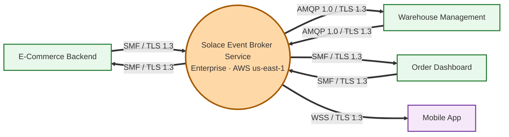
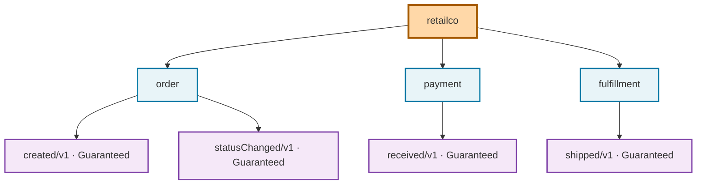
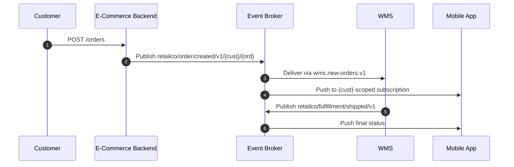
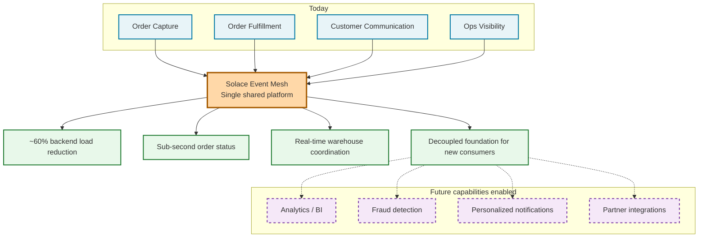

# From Discovery to Runbook: A Skills Toolkit for Architecting Solace EDA

Every Solace event-driven architecture engagement starts the same way. A whiteboard sketch. Five services and a broker. Two arrows. *"We'll figure out the topics later."*

Three weeks later, "later" arrives. The implementation team needs more than a sketch — they need:

- A **topic taxonomy** that scales past the first sprint
- A **broker deployment decision** with sizing math behind it
- An **HA/DR posture** mapped to RPO/RTO targets
- An **ACL model** that does not leak across tenants
- A **migration plan** for the legacy MQ that has to coexist for six more months
- A **runbook** the on-call rotation can actually use at 3am

None of that is on the napkin.

This is the gap I have spent most of my Solace engagements filling by hand. Open a blank document. Write headings. Copy a diagram from the last deck. Trade Slack messages about whether topics should use camelCase or kebab-case. Reread the docs on Dynamic Message Routing for the third time this quarter.

Most of the work is not architecture. It is *re-doing what we already know*, dressed up in the customer's naming.

**Solace Architect** ([solacecommunity/solace-architect](https://github.com/solacecommunity/solace-architect)) is an open-source Claude Code skill toolkit that closes that gap. It is 24 prompt-engineered skills that walk an AI coding agent through a structured EDA engagement — discovery to blueprint to executive summary — and write real artifacts to disk along the way. Markdown documents. Mermaid diagrams. YAML configs. A runbook. The deliverables an implementation team actually needs.

## What an EDA blueprint really has to cover

A finished Solace implementation blueprint is not one document — it is a stack of defensible decisions:

| Layer | What it answers |
|---|---|
| Discovery brief | Systems, flows, reliability targets, constraints |
| Topic taxonomy | `Domain/Noun/Verb/Version/Properties` + delivery modes per event |
| Broker selection | Cloud, Software, or Appliance — defended against constraints |
| SAM design | Agents, Gateways, Micro-Integrations, OrchestratorAgent, A2A topics, auth model |
| Protocol map | SMF, MQTT, AMQP, JMS, REST, WebSocket per integration point |
| Mesh topology | DMR for multi-site, multi-cloud, hybrid |
| HA/DR | Replication groups and failover modeled to RPO/RTO |
| Integration strategy | Integration Hub, custom MIs, Kafka bridge |
| Migration plan | Phased path off Kafka, RabbitMQ, TIBCO, or IBM MQ |
| Event Portal model | Domains, events, schemas, applications, runtime connections |
| Four reviews | Architecture, ops, security, developer experience |
| Engineering handoff | Runbook, broker provisioning params, exec business case |

Skip any one layer and an integration team finds out about it during week four of the build.

## The skill catalog

The toolkit packages this surface area into 24 skills, each invokable as a slash command:

| Category | Skills |
|---|---|
| **Start here** | `/solace-intake`, `/solace-discovery`, `/solace-plan`, `/solace-projects` |
| **Design** | `/solace-topic-design`, `/solace-broker-select`, `/solace-sam-design`, `/solace-protocol-select`, `/solace-mesh-design`, `/solace-ha-dr`, `/solace-migration`, `/solace-integration`, `/solace-event-portal`, `/solace-ep-provision` |
| **Review** | `/solace-architect-review`, `/solace-ops-review`, `/solace-security-review`, `/solace-dev-review` |
| **Finalize** | `/solace-validate`, `/solace-blueprint`, `/solace-architecture-blueprint`, `/solace-executive`, `/solace-diagrams`, `/solace-help` |

Every skill can be re-run independently. Skip the orchestrator and call them one at a time when only one slice needs to change.

## Three commands run the engagement

```
/solace-discovery     # structured interview → discovery brief
/solace-plan          # orchestrates design → review → validate → blueprint → exec
/solace-projects      # status, switch, compare projects side by side
```

Three ways to enter, depending on how you collect requirements:

- **Interactive interview** — `/solace-discovery` asks ~15 structured questions across systems, boundaries, events, protocols, requirements, and goals. About 20–30 minutes.
- **Offline template** — `/solace-intake` produces a DOCX/YAML template for async stakeholder capture, then `/solace-intake import` bootstraps the engagement.
- **Browser form** — `bun run intake` serves `localhost:3001` with autocomplete and a live engagement preview.

All three produce the same brief, and the brief feeds every downstream skill.

`/solace-plan` then does the rest. It reads the brief, decides which skills apply (skip SAM if there is no AI layer; skip migration on greenfield), runs design and review skills in dependency order, validates against the antipatterns catalog, and assembles the engineering handoff package. Every design decision (the toolkit calls them `D<N>`) is logged with the option chosen and the rationale, so you can defend every choice months later.

## What lands on disk

Everything goes under `projects/<slug>/artifacts/`, numbered by stage:

```
projects/retailco-order-events/
├── context.yaml          # project metadata
├── decisions.yaml        # every D<N> with rationale
├── progress.yaml         # per-skill status + timing
└── artifacts/
    ├── 01-discovery/     ├── 08-integration/
    ├── 02-topic-design/  ├── 10-reviews/
    ├── 03-broker-select/ ├── 11-validation/
    ├── 05-protocol/      ├── 12-blueprint/   ← engineering handoff
    ├── 06-mesh-design/   ├── 13-event-portal/
    ├── 07-ha-dr/         └── 14-executive/
```

For a recent retailco order-events engagement, the **system-context diagram** comes out like this — services, broker, per-edge protocol, all in one view:



That is not a stock illustration — it is the actual Mermaid the `/solace-blueprint` skill writes after `/solace-protocol-select` resolves each edge. Same with the topic taxonomy, generated from the discovery flows and validated against antipatterns:



The end-to-end flow falls out as a sequence diagram, customer-scoped subscription and all:



## Why grounding matters more than fluency

What separates this from "ChatGPT writes an architecture doc" is **grounding discipline**. Every skill is constrained to assert only what is in:

- `docs.solace.com`
- `solacelabs.github.io/solace-agent-mesh`
- `github.com/SolaceLabs`
- `solace.com/integration-hub`

When a capability is not documented, the skill says so explicitly. No invented features. No borrowed Kafka concepts dressed up in Solace clothing.

Terminology is enforced:

| ✅ Use this | ❌ Not this |
|---|---|
| Micro-Integration | "connector" |
| Direct messaging / Guaranteed messaging | "QoS levels" |
| OrchestratorAgent | "orchestrator agent" |
| DMR | "federation" |
| Event broker service / Solace Software Event Broker | "the broker" |

Sounds pedantic — until you watch a customer team build for six weeks against an invented Solace feature. The toolkit's working principle is that an AI which confidently recommends a non-existent capability is *worse than useless*. "I don't know, check the docs" is the right answer when the docs don't cover it.

Four principles drive every skill:

- **Boil the Lake** — completeness is cheap with AI; do the complete thing every time
- **Search Before Building** — Solace docs first, community second, first principles third
- **Accuracy Over Fluency** — say "I don't know" rather than fabricate
- **User Sovereignty** — the AI recommends, the user decides

## Bridge to a live tenant (optional)

One skill, `/solace-ep-provision`, materializes the Event Portal model into a live Solace Cloud tenant via the [Solace Event Portal Designer MCP](https://github.com/SolaceLabs/solace-platform-mcp/tree/main/solace-event-portal-designer-mcp). It is **opt-in only**:

- Set `preferences.provision_event_portal: true` at intake — default is `false`
- The skill creates domains → schemas → events → applications in dependency order
- A **content-match verification** runs before reusing any existing object, so reruns on shared tenants are safe
- Every provisioned application emits an **AsyncAPI document** wired for code generation and contract testing
- If the MCP is unavailable at runtime, the skill records `BLOCKED` — never writes silently, never skips silently

Most design-only engagements leave this gate off. Turn it on when the design is ready to land.

## Handoff packs for each audience

Once `/solace-plan` finishes, `bun run dashboard` opens a project view at `localhost:3000`: overview tiles, decision log, timeline, artifact tree, one-click export. The export turns the whole engagement into a **self-contained HTML file** you can email, attach to a ticket, or drop in a repo.

Audience-scoped report packs slice the same artifacts for different readers:

| Report pack | For | Contains |
|---|---|---|
| **Comprehensive** | Everyone (default) | Full deliverable: every artifact, decision, finding |
| **System & Engineering** | Implementation team, eng leads | Kruchten 4+1 views (logical, process, dev, physical, scenarios) |
| **Strategic Executive** | CXO, sponsors, investment committee | Business case, ROI, recommendation in plain language |
| **Infrastructure & Ops** | Solace admin, SRE, on-call | Provisioning params, monitoring, runbooks, HA/DR |
| **Security & Governance** | Security architect, compliance, audit | Auth, ACLs, encryption, PII, audit posture |
| **Application Developer** | App engineers writing client code | Topics, schemas, protocols, AsyncAPI exports |

The executive pack writes its own business-architecture diagram, mapping today's capabilities through the mesh to outcomes — and the future capabilities the platform unlocks:



That is the diagram that ends up in the CXO deck. Same body of decisions, reprojected for a different reader.

## What this changes

I still run my own engagements. I still make every consequential decision. What the toolkit changes is what *brackets* the decisions:

- The discovery interview — done in 30 minutes, not a two-day workshop
- The antipattern checks — automatic, against a maintained catalog
- The diagram regeneration — re-run `/solace-diagrams` after a flow changes
- The audience-specific repackaging — one click in the dashboard

Iteration is cheap:

```
/solace-topic-design   # change something upstream
/solace-validate       # re-check consistency and antipatterns
/solace-blueprint      # refresh the engineering handoff package
```

The dashboard always reflects the current state. No stale Confluence page to chase.

If you do Solace EDA work — as a solutions architect, a consultant, or an enterprise architect with a real engagement on your desk — clone it, run `./install-sa.sh`, and try `/solace-discovery` on the next project that lands.

The first run is the convincing one.

**Repo:** [github.com/solacecommunity/solace-architect](https://github.com/solacecommunity/solace-architect)
